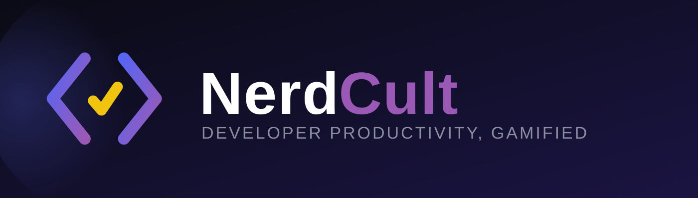
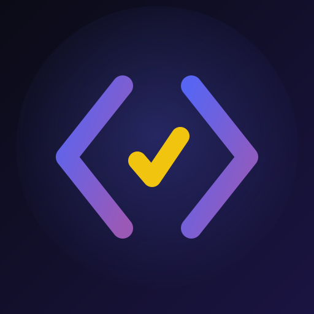

<div align="center">



**Turn your Discord server into a developer productivity operating system.**


</div>

---

## What is this?

**DevOS** is a developer-first productivity bot for Discord. It gives each member their own todos, goals, reminders, focus sessions, streaks, XP, and dev-account integrations, then layers a public, guild-scoped social surface on top — leaderboards, a shared completion board, and community challenges. Every interaction is driven by **buttons, select menus, and modals** rather than typed sub-commands, and the whole thing is gamified with XP, levels, and auto-awarded badges.

---

## Screenshots

> 📸 Add a screenshot of the `/todo` panel here
>
> 📸 Add a screenshot of the `/dev-stats` rendered contribution graph here
>
> 📸 Add a screenshot of the `/leaderboard` embed here

---

## Features

### Personal productivity
- **Todos** (`/todo`) — a button/modal panel to add, complete, edit, and delete tasks.
- **Goals** (`/goal`) — track progress with rendered progress bars.
- **Reminders** (`/remind`) — natural-language scheduling (e.g. *tomorrow 8am Gym*) via `chrono-node`, polled and delivered on time.
- **Today** (`/today`) — a single overview of open todos, upcoming reminders, and goal progress.

### Focus & streaks
- **Focus sessions** (`/focus`) — start/stop Pomodoro-style timed work sessions that award XP on completion.
- **Streaks** (`/streak`) — your current and best productivity streaks, plus a server-wide streak view.

### XP & badges
- **Levels** (`/level`) — current level and an XP progress bar.
- **Stats** (`/stats`) — overall productivity stats and a derived Productivity Score.
- **Badges** (`/badges`) — earned and locked badges from a declarative registry, evaluated after every XP event.

### Dev integrations (GitHub · LeetCode · Codeforces)
- **Link accounts** (`/link`) — connect GitHub, LeetCode, and Codeforces to earn XP from real activity.
- **Combined dev stats** (`/dev-stats`) — today's activity across all three, including a **rendered GitHub contribution graph** (via `@napi-rs/canvas`) and **private-activity detection** so private-repo contributions still count.
- **Activity broadcasts** — notable dev activity is celebrated in shared guilds via the broadcast system.

### Community
- **Leaderboard** (`/leaderboard`) — guild top 10 by XP, with per-user current and best streaks.
- **Board** (`/board`) — a public, paginated server-wide todo completion board.
- **Challenges** (`/challenge`) — admin-created community challenges members can complete.
- **Settings** (`/settings`) — per-user settings, including timezone and opt-in/opt-out of public surfaces.

---

## Tech stack

- **Language:** TypeScript (strict)
- **Runtime:** Node.js 22
- **Discord:** [discord.js](https://discord.js.org/) v14
- **Database:** PostgreSQL 16 via [Prisma](https://www.prisma.io/) ORM
- **Scheduling:** `node-cron` (reminder delivery, integration polling, streak checks, weekly recap)
- **Validation:** `zod` on every command option and modal submit
- **Dates:** `luxon` + `chrono-node`
- **Rendering:** `@napi-rs/canvas` for contribution graphs
- **Logging:** `pino` (+ `pino-pretty` in dev)
- **Deployment:** Docker + Docker Compose (bot + Postgres)

---

## Setup

Detailed design and behavioral spec lives in [`docs/discord-bot-implementation-spec.md`](docs/discord-bot-implementation-spec.md). The steps below are the condensed path from clone to running bot.

### Prerequisites
- Node.js 22+
- Docker & Docker Compose (for Postgres)
- A Discord application + bot token from the [Discord Developer Portal](https://discord.com/developers/applications)

### Steps

```bash
# 1. Clone & install
git clone <repo-url>
cd devos-bot
npm install

# 2. Configure environment
cp .env.example .env    # then fill in the values (see table below)

# 3. Start Postgres (or point DATABASE_URL at any Postgres 14+ instance)
docker-compose up postgres -d

# 4. Apply migrations & generate the Prisma client
npx prisma migrate deploy
npx prisma generate

# 5. Seed baseline data (badges, etc.)
npm run db:seed

# 6. Register slash commands with Discord (re-run when a command changes)
npm run deploy

# 7. Run the bot
npm run dev      # development (ts-node, no build)
# — or —
npm run build && npm start
```

> **Privileged intent:** enable the **Server Members Intent** in the Developer Portal (Bot → Privileged Gateway Intents). Without it the bot boots, but activity broadcasts silently find zero shared guilds.

### Full stack via Docker

```bash
docker-compose up --build
```

Starts `postgres` + `bot`. On startup the `bot` container runs `prisma migrate deploy` (create/upgrade tables) and then `node dist/seed.js` (seed the baseline badge rows the auto-award system checks against) before launching — both are idempotent, so no manual DB steps are needed inside Docker.

Two things Docker does **not** do for you:

- **Register slash commands.** Run `npm run deploy` once from a local checkout (it needs your bot token). This is not part of the image because command registration uses `ts-node`, a devDependency the production image intentionally omits — so it requires a local Node environment with `npm install` already run.
- Everything else (migrations, seeding) is handled by the container command.

A recent performance pass reduced startup and interaction latency (early `deferReply`, parallelized independent DB reads, added indexes on hot foreign keys, and hardened against serverless-Postgres cold starts).

---

## Environment variables

Read from [`src/config/env.ts`](src/config/env.ts) and validated with `zod` at boot — the process fails fast if a required variable is missing.

| Variable | Required | Description |
|---|---|---|
| `DISCORD_TOKEN` | ✅ | Bot token from the Discord Developer Portal. |
| `DISCORD_CLIENT_ID` | ✅ | Application (client) ID from the Developer Portal. |
| `DATABASE_URL` | ✅ | PostgreSQL connection string. |
| `GITHUB_TOKEN` | ⚠️ | Optional at boot, but **required in practice for the GitHub integration to function**. The poller runs every 2 minutes; unauthenticated REST is capped at 60 requests/hour and the GraphQL private-activity check rejects unauthenticated requests outright. The bot starts without it and logs a warning — omit it only if you won't use `/link github`. |
| `BOT_ICON_URL` | — | Optional **override** for the embed footer icon. Not needed normally — the footer defaults to the bot's own Discord-hosted avatar, so it works with no config once the bot has a profile picture. Set this only to show a different image. Must be a public HTTPS URL Discord can fetch anonymously; blank is treated as unset. |
| `AUTO_SET_AVATAR` | — | Optional. When exactly `"true"`, the bot sets its own avatar once on startup. Off by default; never retried (Discord rate-limits avatar changes). Uploading the icon manually via the Developer Portal is the recommended path. |

---

## Command reference

Every command is a single entry point; the rest of each flow is buttons, select menus, and modals.

| Command | Description |
|---|---|
| `/todo` | Open your personal todo panel. |
| `/goal` | Open your personal goal panel. |
| `/habit` | Open your personal habit panel. |
| `/remind` | Set a reminder or list upcoming reminders. |
| `/today` | Show today's overview: open todos, reminders, and goal progress. |
| `/focus` | Start or stop a Pomodoro focus session. |
| `/streak` | View your current and best productivity streaks. |
| `/stats` | View your overall productivity stats and Productivity Score. |
| `/level` | View your current level and XP progress bar. |
| `/badges` | View your earned and locked productivity badges. |
| `/link` | Link an external dev account (GitHub / LeetCode / Codeforces) to earn XP. |
| `/dev-stats` | Your combined dev activity today across GitHub, LeetCode, and Codeforces. Posts publicly. |
| `/leaderboard` | View the guild leaderboard (top 10 by XP). |
| `/board` | View the server todo completion board (shared public view). |
| `/challenge` | Community challenges — `create` (admin) and `complete` subcommands. |
| `/settings` | Manage your user settings. |
| `/ping` | Verify the bot is online — returns latency and a router test button. |

---

## Project structure

```
src/
  commands/          # one folder per command (todo, goal, board, dev-stats, …)
  events/
    ready.ts         # fires on login (optional one-shot avatar set)
    interactionCreate.ts  # global router — parses customId, verifies ownership, dispatches
  services/          # business logic (todoService, xpService, broadcastService, …)
  database/
    prisma.ts        # singleton PrismaClient
  utils/             # progress bars, customId encode/decode, embedFactory, …
  embeds/            # per-domain embed builders
  badges/
    registry.ts      # declarative badge rules
  cron/              # reminder poller, GitHub poller, streak check, weekly recap
  config/
    env.ts           # zod-validated env vars — fails fast on boot
    branding.ts      # icon paths / URL wiring
  assets/            # brand assets (icon + wordmark)
  index.ts           # entry point
prisma/
  schema.prisma
docker-compose.yml
Dockerfile
```

---

## Conventions

- **One slash command per domain** — everything after the entry point is a component interaction.
- **customId format** `domain:action:ownerId:entityId` — the router verifies ownership before dispatching.
- **All replies are embeds** — no bare-string replies.
- **Personal data is ephemeral; social data is public** — subject to opt-in/opt-out settings. `/dev-stats` is the deliberate exception: it shows only the caller's own data, so running it *is* the choice to share.

---

## License

<div align="center">



**License: TBD** — no license file is present in this repository yet.

<sub>Built with TypeScript, discord.js, and Prisma.</sub>

</div>
